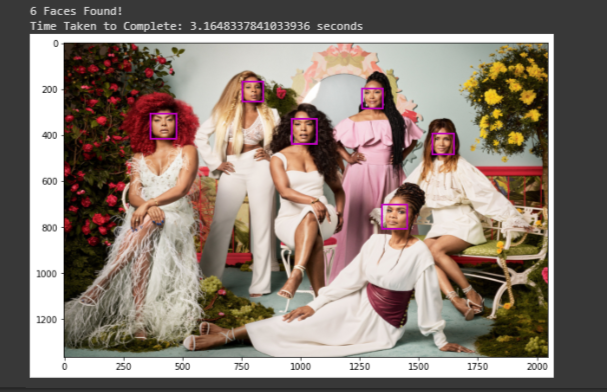
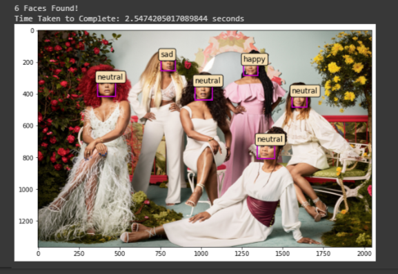

# Rekonize

Rekonize is a trained model that undergoes multiple iterations of facial recognition and detection. Rekonize detects faces in any uploaded image and assumes the emotion of the detected face(s). It currently is pre-programmed to only detect up to 50 faces in any given image. 

## Installation

Rekonize was programmed utilizing Google Colaboratory, therefore, this can run on any machine. Colab direct link to get started: https://colab.research.google.com/

Step 1: 
	Upload rekonize.ipynb file into Colab.

Step 2:
Before running anything, be sure to check: Runtime < Change Runtime Type < Select "GPU". If you run the program before this, the required libraries will not install.

Step 3:
To run the program all at once, select Runtime < Run All. You may instead run each cell individually in order to see a step-by-step of what the program is doing. This step is the user’s personal preference. 

## Usage/Examples

User’s Uploaded Image

Reckonize Detected 6 Faces

Rekonize Detected Each Face’s Emotion

## Future Development

To elaborate on this model, we aim to amend the current errors one may encounter while using Rekonize. We also are looking into retraining the model to better distinguish between emotions and better asses emotions when uploading images with multiple people. Currently, group photos only work about 50% of the time. We hope in the future to allow the program to not only asses faces in uploaded images, but in uploaded videos and even from a user’s webcam. Eventually, looking into including facial encodings for Rekonize to remember and store faces to include the person’s name whenever an image of that person is uploaded again. 

## Tools & Resources

Google Colaboratory - https://colab.research.google.com/

Face Recognition Library - https://github.com/ageitgey/face_recognition

FER - https://pypi.org/project/fer/
